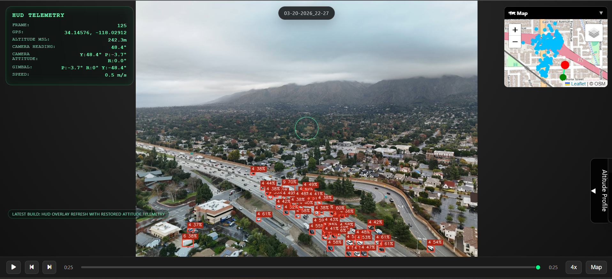

# DJI Drone Fire Mapping

Science fair project for post-flight DJI hyperlapse analysis, telemetry visualization, and YOLOv8-based object detection/geolocation experiments.

## Final Viewer



## Overview

This repository currently works as a post-flight analysis pipeline for DJI Mini 4 Pro hyperlapse image sets.

Right now the most complete path is:

- extract telemetry from DJI EXIF/XMP metadata
- generate timestamped analysis reports with a viewer, map, and altitude profile
- run a trained YOLOv8 model on frames
- project detections onto the map using a camera-ray-to-ground-plane approximation

The project is still called "Fire Mapping", but the current trained model and examples are vehicle-detection oriented rather than wildfire-detection oriented. Due to the lack of available datasets and models for fire hazard detection, we were unable to acheive "Fire Mapping".

**Workflow:**
1. Create flight plan with [waypointmap.com](https://waypointmap.com) or similar
2. Load plan onto drone via DJI Fly app
3. Start mission manually, use HYPERLAPSE mode, save as JPG
4. Hyperlapse records images with GPS/gimbal data in EXIF metadata
5. Download images and run through analysis pipeline

**Current Features:**
- 📷 Hyperlapse viewer with telemetry HUD
- 📍 DJI EXIF/XMP telemetry extraction for GPS, altitude, gimbal angles, drone attitude, and camera heading
- 🗺️ Timestamped HTML map and static trajectory overview generation
- 📊 Altitude profile generation
- 🌐 Local report serving for newest or selected outputs
- 🚗 YOLOv8 car placeholder model for object detection overlay in the viewer

**Current Limitation:**
- Detection geolocation is still experimental. The pipeline now projects detections by raycasting from the camera onto a relative ground plane at `z = 0` using altitude since takeoff when available, but the mapped points are not yet reliably accurate enough to trust as final road-true positions.

**Planned Direction:**
- improve camera ray geometry and calibration
- improve road-plane / ground-plane assumptions
- revisit fire-specific model training once mapping accuracy is acceptable

Based on research from [forest_fire_detection_system](https://github.com/lee-shun/forest_fire_detection_system).

## Quick Start

### 1. Setup
```bash
powershell -ExecutionPolicy Bypass -File .\setup.ps1
```

That one command creates `.venv`, upgrades `pip`, and installs the project dependencies.

If you prefer to do it manually:

```bash
python -m venv .venv
.venv\Scripts\Activate.ps1
pip install -r requirements.txt
```

The repository is intended to contain source code and configuration only. Local environments, downloaded datasets, raw flight data, and training outputs are not committed.

### 1.1. Configure API Keys
Create a local `.env` file from `.env.example` and set your Roboflow key:

```bash
copy .env.example .env
```

Then edit `.env`:

```env
ROBOFLOW_API_KEY=your-roboflow-key-here
```

The training notebook will load `.env` automatically and will prompt for the key if it is still missing.

### 2. Prepare Flight Plan
- Go to [waypointmap.com](https://waypointmap.com)
- Create a survey mission (zigzag pattern recommended)
- Export and import into DJI Fly app

### 3. Execute Flight
- Launch DJI Fly app
- Select your waypoint mission
- Set HYPERLAPSE mode (2-5 second interval)
- Point gimbal at -90° (straight down)
- Start flight

### 4. Download & Analyze
```bash
# Copy downloaded hyperlapse folder to data/raw/

# Analyze from command line
python main.py --analyze data/raw/001_0538 --output data/outputs

# Serve the newest generated report
python main.py --serve-latest
```

### 5. Optional Local Assets
These folders are expected to be created locally on each machine and are ignored by Git:

- `.venv/`
- `data/raw/`
- `data/processed/`
- `data/outputs/`
- `notebooks/visdrone-1/`
- `notebooks/runs/`
- `runs/`

### 6. Optional GPU Upgrade
The default install command uses the standard PyPI packages. If the machine has an NVIDIA GPU and you want CUDA-enabled PyTorch, upgrade those two packages after setup:

```bash
.venv\Scripts\python.exe -m pip install --upgrade torch torchvision --index-url https://download.pytorch.org/whl/cu128
```

## Project Structure

```
src/
├── drone_control/
│   └── flight_manager.py       # Flight plan guide, hyperlapse info
├── image_processing/
│   └── image_handler.py        # Frame preprocessing (future use)
├── detection/
│   └── detector.py             # Fire detection model (future)
└── visualization/
    ├── telemetry.py            # EXIF parsing, flight trajectory
    ├── viewer.py               # Image viewer + telemetry overlay
    └── map_generator.py        # Folium maps, altitude profiles

notebooks/
├── hyperlapse_viewer.ipynb     # Interactive viewer & analysis notebook
├── fire_detection_exploration.ipynb  # Older exploration notebook
└── train.ipynb                 # Roboflow + YOLOv8 training notebook

config/
└── config.yaml                 # Settings & drone parameters

data/
├── raw/                        # Hyperlapse folders from drone
├── processed/                  # Processed images
└── outputs/                    # Maps and reports
```

## Dependencies

**Core:**
- `opencv-python` - Image processing
- `Pillow` - EXIF/XMP metadata extraction
- `numpy` - Array operations
- `PyYAML` - Configuration loading
- `python-dotenv` - Local environment variable loading
- `defusedxml` - Safer XML handling
- `piexif` - EXIF utilities

**Visualization:**
- `matplotlib` - Charts and plots
- `folium` - Interactive maps
- `Leaflet` - Browser-side interactive map rendering used by Folium and the viewer minimap
- `OpenStreetMap` / `Esri World Imagery` - Map tile providers
- `Font Awesome` - Viewer iconography loaded from CDN

**Data handling:**
- `pandas` - Tabular data utilities used by the project environment

**Detection / training:**
- `ultralytics` - YOLOv8 model
- `torch`, `torchvision` - YOLOv8 runtime / training backend

**Development / notebooks:**
- `jupyter` - Notebook workflow
- `pytest` - Test runner

See [requirements.txt](c:/Users/41409/DJI_Drone_Fire_Mapping/requirements.txt) for Python package versions.

## Usage

### Using Jupyter Notebook
```bash
jupyter notebook notebooks/hyperlapse_viewer.ipynb
```

Then:
1. Edit `HYPERLAPSE_FOLDER` to point to your image folder
2. Run cells in order
3. Use slider to browse images with telemetry
4. View generated maps in `data/outputs/`

### Using Command Line
```bash
# Show flight instructions
python main.py --help-flight

# Analyze hyperlapse folder
python main.py --analyze data/raw/001_0538 --output data/outputs

# Serve the newest generated report
python main.py --serve-latest

# Serve a specific report folder by name
python main.py --serve 03-15-2026_13-06

# List reports and choose one interactively
python main.py --list-reports

# Optional: run a specific YOLOv8 model
python main.py --analyze data/raw/001_0538 --output data/outputs --detect-model path/to/model.pt

# Optional: keep multiple classes and change the threshold
python main.py --analyze data/raw/001_0509 --output data/outputs --detect-model path/to/model.pt --detect-class car --detect-class truck --detect-confidence 0.35
```

Generated reports are written to timestamped folders under `data/outputs/`. When the viewer changes, generate a new report rather than editing an older output folder in place.
If a trained model is available under `runs/` or `notebooks/runs/`, the analysis command will use the newest `weights/best.pt` automatically unless `--detect-model` is provided.
Detection-enabled runs also write `object_detections.json`, `car_detection_report.txt`, and `car_detections.geojson`.

## Telemetry Data

Each hyperlapse image contains metadata in EXIF/XMP:

- **GPS**: Latitude, longitude, altitude
- **Gimbal**: Pitch, roll, yaw angles
- **Drone Attitude**: Pitch, roll, yaw, and speed components when present in DJI XMP
- **Camera Heading**: Earth-relative heading derived from DJI gimbal/drone metadata
- **Timing**: Image capture timestamp
- **Drone**: Model, firmware version

The system extracts this automatically and displays:
- Live telemetry overlay on images
- GPS position minimap
- Altitude profile chart
- Flight trajectory visualization
- Earth-relative azimuth and elevation readouts in the HUD viewer

## DJI Mini 4 Pro Notes

⚠️ **SDK Limitation:** Mini 4 Pro does NOT support onboard SDK control (DJI Fly Mobile SDK only).

**Why Hyperlapse?**
- ✓ Automatic GPS logging in EXIF
- ✓ Gimbal angle recording
- ✓ Works with autonomous waypoint plans
- ✓ Mobile app only (no complex SDK setup)
- ✗ Post-processing only (not real-time)

**Flight Specifications:**
- Max altitude: 2500m (limited by regulation)
- Recommended survey altitude: 40-60m (good image resolution)
- Flight time: ~31 min max (limit at 20% battery)
- Payload: ~249g (no external cameras)
- Video: 4K/30fps max (hyperlapse uses high-res stills)

## Hyperlapse Flight Setup

1. **DJI Fly Settings:**
   - Mode: HYPERLAPSE
   - Interval: 2-5 seconds between frames
   - Gimbal Pitch: -90° (nadir/downward)
   - Resolution: 4K (4096×2160)

2. **Pre-flight:**
   - Format SD card on drone
   - Verify GPS lock (wait ≥20 satellites)
   - Check battery ≥80%

3. **Expected Output:**
   - Folder: `Hyperlapse_XXXX/` with IMG_XXXX.jpg files
   - Each image has GPS + gimbal data in EXIF
   - ~1 image per waypoint in survey area

## Training Notebook

Use [notebooks/train.ipynb](notebooks/train.ipynb) to:

- load a Roboflow dataset using `ROBOFLOW_API_KEY`
- verify PyTorch / CUDA availability
- train a YOLOv8 model

Typical workflow:

1. Train on a machine with NVIDIA CUDA support.
2. Copy the resulting `best.pt` back into this repository.
3. Run `main.py --analyze ...` and let the pipeline auto-pick the newest weights file.

## Example Workflow

```python
from src.visualization.telemetry import TelemetrySequence
from src.visualization.viewer import TrajectoryMapGenerator

# Load hyperlapse images
telem_seq = TelemetrySequence('data/raw/my_hyperlapse/')

# Extract GPS, altitude, gimbal, and attitude from EXIF/XMP
telemetry = telem_seq.extract_telemetry()

# Get flight bounds
bounds = telem_seq.get_bounds()
print(f"Flight area: {bounds['north']} - {bounds['south']} lat")

# Generate maps and interactive report assets
map_gen = TrajectoryMapGenerator(telem_seq)
map_gen.create_trajectory_map('trajectory.html')
map_gen.create_altitude_profile('altitude_profile.png')
map_gen.create_interactive_video_viewer('hyperlapse_viewer.html')
```

## Viewer And Reports

- The HTML viewer is generated into each report folder as `hyperlapse_viewer.html`.
- Reports are timestamped like `03-15-2026_13-06/` so older analysis snapshots remain inspectable.
- `--serve-latest` serves the newest report on `http://localhost:8001/hyperlapse_viewer.html` with cache disabled.
- The viewer includes a HUD-style center sight, top azimuth ruler, right elevation ruler, minimap, and slide-out altitude profile.
- The altitude shown in the telemetry/report is GPS altitude above mean sea level, not above local ground.

## Detection Overlay

The analysis pipeline currently supports YOLOv8 detections for vehicles or other trained classes.

- `--detect-model`: path to a YOLOv8 `.pt` model
- `--detect-class`: class label to keep from the model output; repeat the flag for multiple classes
- `--detect-confidence`: minimum confidence threshold for retained detections

When detection mode is enabled:

- The HUD viewer draws red bounding boxes over the current frame.
- The map output adds markers for projected detections.
- The minimap and saved trajectory map show red markers for geolocated detections.

## Current Geolocation Model

The current implementation does not use a finished 3D reconstruction model.

- Each detection is converted into a camera ray.
- That ray is intersected with a local ground plane at `z = 0`.
- Drone altitude since takeoff is used when available; otherwise the first frame altitude is used as a reference.
- This is useful for iteration and debugging, but not yet accurate enough for final mapping claims.

Implementation lives mainly in [src/visualization/map_generator.py](src/visualization/map_generator.py) and [main.py](main.py).

## Known Issues

- Geolocated map points are still visibly offset in some reports.
- WebM encoding logs an OpenCV/FFMPEG VP80 warning on Windows, but the output video is still written successfully.
- The repository name and some class names still reference "fire mapping" even though the active trained model and examples are vehicle-focused right now.

## Safety

⚠️ **Before any flight:**
- Obtain necessary permits (check local regulations)
- Check airspace restrictions (use B4UFLY app)
- Test all systems on ground first
- Have emergency procedures
- Fly only in safe, designated areas
- Maintain visual line of sight

## References

- [DJI Mini 4 Pro Specs](https://www.dji.com/ca/mini-4-pro/specs)
- [DJI Fly App](https://www.dji.com/downloads/djiflysafe)
- [Waypointmap.com](https://waypointmap.com/)
- [Lee Shun's Fire Detection System](https://github.com/lee-shun/forest_fire_detection_system)
- [VisDrone Dataset](https://github.com/VisDrone/VisDrone-Dataset)
- [Roboflow](https://roboflow.com/)
- [YOLOv8 Documentation](https://docs.ultralytics.com/)
- [OpenStreetMap](https://www.openstreetmap.org/)
- [Esri World Imagery](https://www.esri.com/en-us/arcgis/products/arcgis-online/base-maps)

## Credits

- Vehicle-detection training and experimentation in this repository use the [VisDrone Dataset](https://github.com/VisDrone/VisDrone-Dataset).
- Dataset workflow and notebook-based training setup were built around [Roboflow](https://roboflow.com/) and [Ultralytics YOLOv8](https://docs.ultralytics.com/).
- The trajectory map and minimap use [OpenStreetMap](https://www.openstreetmap.org/) and [Esri World Imagery](https://www.esri.com/en-us/arcgis/products/arcgis-online/base-maps) tiles.
- Early project direction and wildfire-detection research references were informed by [Lee Shun's Fire Detection System](https://github.com/lee-shun/forest_fire_detection_system).
- Hyperlapse analysis, telemetry extraction, viewer/report tooling, and the current geolocation experiments in this repository were developed for this project.

## License

This project is licensed under the Apache License 2.0. See [LICENSE](LICENSE).
